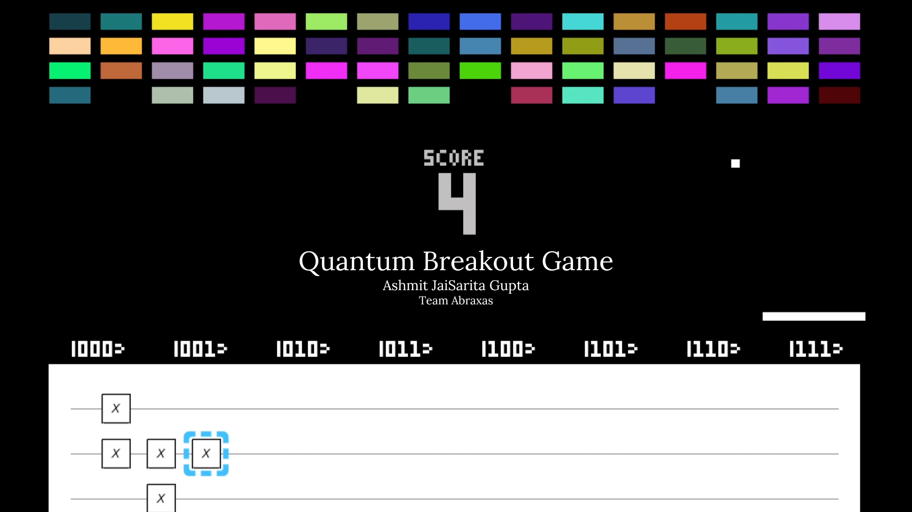

<h1 style="text-align:center">Quantum Breakout Game: Quantum Version of Classic Breakout Game</h1>

<h3 style="text-align:center"><a href="https://jaisarita.itch.io/quantum-breakout" target="_blank">Download from Itch.io</a> | <a href="https://github.com/devilkiller-ag/quantum-breakout" target="_blank">GitHub Repository</a></h3>

In the realm of quantum computing, the journey from novice to expert can be an intimidating and complex one. Bridging this gap is crucial to unlocking the true potential of quantum technologies. Our project: <b>The Quantum Breakout Game</b> by <b><a href="https://jaisarita.vercel.app/" target="_blank">Ashmit JaiSarita Gupta</a></b> is an initiative to help undergraduate freshers and beginners in learning one of the most fundamental concepts of Quantum Computing: <b>Qubit Manipulation using Quantum Gates</b> easily in a gamified manner.

Our methodology combines principles of gamification, quantum computing, and education. The Quantum Breakout Game is a quantum version of the Classic Breakout Game by Atari, Inc. built using Pygame and Qiskit. In the Classic Breakout Game, the player has to knock down as many bricks as possible by using a single ball and the paddle below to hit the ball against the bricks and eliminate them. In this quantum version of the game, players must control the paddle by constructing a three-qubit circuit such that the probability of the paddle being above the state vector where the ball is about to come is maximum. The opacity of the paddle indicates the probability of the paddle being above a certain state, 100% opacity (pure white) indicates the 100% probability, and 0% opacity (transparent) indicates the 0% probability of the state. As the ball comes near the paddle the measurement is done and the position of the paddle collapses to a being above a certain state which was in superposition before the measurement.

This game is highly inspired by the QPong game developed by Junye Huang. Ashmit is thankful to him and Qiskit for releasing a basic tutorial for building QPong in a YouTube series: <a href="https://youtube.com/playlist?list=PLOFEBzvs-VvodTkP_rfrs3RWdeWE9aNRD" target="_blank">12 Days of Qiskit</a> without which it would have been hard for him to develop this game.

# Game Demo
https://github.com/Team-Abraxas/Projects-Nimbus-2023/assets/43639341/3a0a1933-c717-489d-956a-fbd8fba37091

# Download & Install Instruction
1) Unzip the Downloaded Zip File
2) Open the Game Folder
3) Install the requirements using the command: `pip install -r requirements-dev.txt​` on your terminal.
4) Run the `main.py` file using the command: `python main.py`

# Play Instruction
- W, A, S, D Keys: Move the "Circuit Cursor" in the Quantum Circuit to where you want to add a gate in the circuit.
- Backspace Key: Remove the gate present at the Circuit Cursor.
- Delete Key: Clear the Quantum Circuit, i.e., remove all gates from the Quantum Circuit.
- X Key: Add X Gate to the quantum circuit.
- Y Key: Add Y Gate to the quantum circuit.
- Z Key: Add Z Gate to the quantum circuit.
- H Key: Add H Gate to the quantum circuit.
- C, R, E Keys: Press the C Key to convert the X, Y, Z, or H gates into CX, CY, CZ, and CH gates respectively, then press the R Key and F Key to the control to qubit above or below.
- Q and E Keys: To convert X, Y, and Z into RX, RY, and RZ gates respectively. Q Key decreases the rotation angle by π/8 and E Key increases the rotation angle by π/8.

# About the Project Developer
This game is developed by<a href="https://jaisarita.vercel.app/" target="_blank">Ashmit JaiSarita Gupta</a>. He is an Engineering Physics Undergraduate at the National Institute of Technology Hamirpur passionate about Quantum Computing, Machine Learning, UI/UX, and Web Development. He is an Executive Volunteer of Team Abraxas. 
